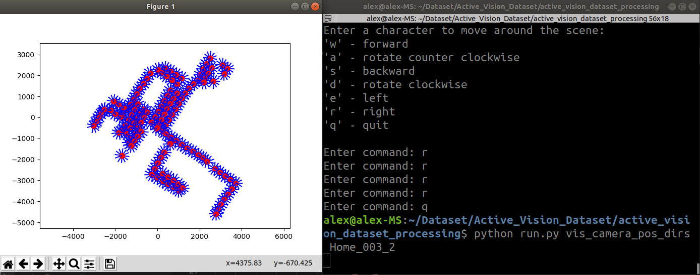
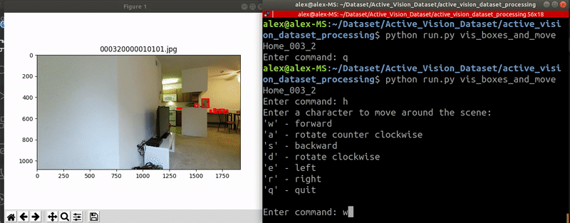

# Active Vision Dataset API

If you are looking for the old repository, pre March 2018, it is [here](https://github.com/pammirato/active_vision_dataset_processing)

This project contains Python and MATLAB scripts for processing the
 [Active Vision Dataset](http://cs.unc.edu/~ammirato/active_vision_dataset_website/index.html)


# DATA LOADING
A starting point for loading our data in python for detection
or classification of instances. See `data_loading/demo.py`

With this code, you can:

1. Get an iterable data structure that gives images and bounding box labels
2. Use the data structure to crop boxes for classification
3. Apply pre-defined and custom transforms to the images and labels 


# Visualizations
Use the code here to visualize our data. See the README in this folder for examples.

To get started, edit the `ROHIT_BASE_PATH` variable in `run.py` and/or `init_paths.m`
to point to the directory that contains our data. i.e. the parent directory 
that the directory for each scan.

```
  ROHIT_BASE_PATH = /path/to/dataset/
```

## Running visualization code
Everything is a function. See examples below
for how to run certain functions, or look at the README
in the visualizations directory 
### Python
To run a python function from the command line:
  ```
  python run.py function_name scene_name
  ```

### MATLAB
1. Start MATLAB
2. Run `init_paths`
3. Call the desired function

# Camera Pose
  
  
# Visualize Dataset
  
  
# Convert Dataset to Rosbag
```
cd ros
python3 images2rosbag.py [images dir] [bagname]
```  
Example
```
python3 images2rosbag.py /home/alex/Dataset/Active_Vision_Dataset/ActiveVisionDataset/Home_001_1/jpg_rgb Home_001_1.bag
```  
rosbag play in rviz  
  

